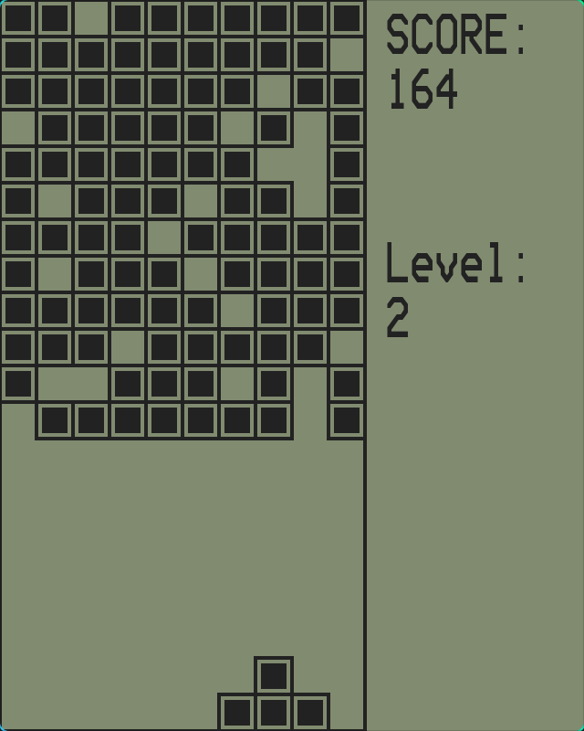
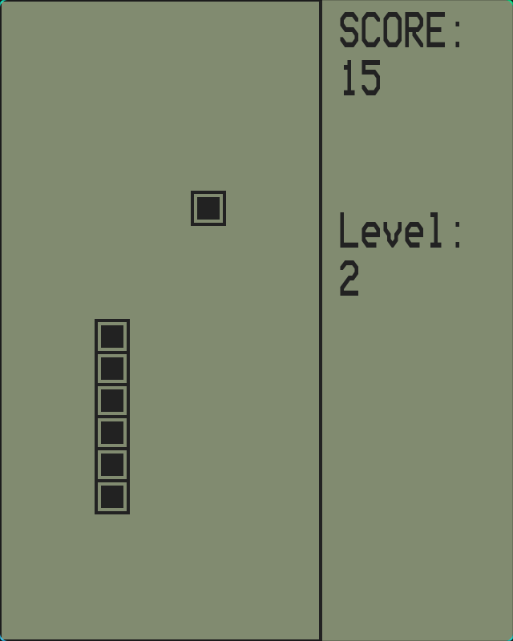

# Brickgames

Implementation of various games from classic 999-in-1 brick games using [Love2D][1].

- [x] wavebreaker
- [x] snake
- [ ] tetris
- [ ] traffic dogger

## Running

Make sure you have `love` installed. Then run `just build` to build the project
and `just run` to start the game. The `build` command creates a zip file of the
repo with a `.love` extension and the `run` command invokes `love` with the
zip file.

## Games

### WaveBreaker

- Advancing wave is filled in with bullets until a full line is filled and removed.
- The wave advances periodically
- Game ends when wave reaches bottom

Controls:

- "A"/"Left" - move left
- "D"/"Right" - move left
- "W"/"Up" - fire bullet
- "Space" - pause
- "q" - Quit

### Snake

- snake moves around a grid
- food randomly appears on grid
- snake grows longer when it eats food
- bonus food appears and disappears if not eaten

Controls:

- "A"/"Left" - move left
- "D"/"Right" - move left
- "W"/"Up" - move up
- "S"/"Down" - move down
- "Space" - pause
- "q" - Quit

[1]: https://www.love2d.org/
